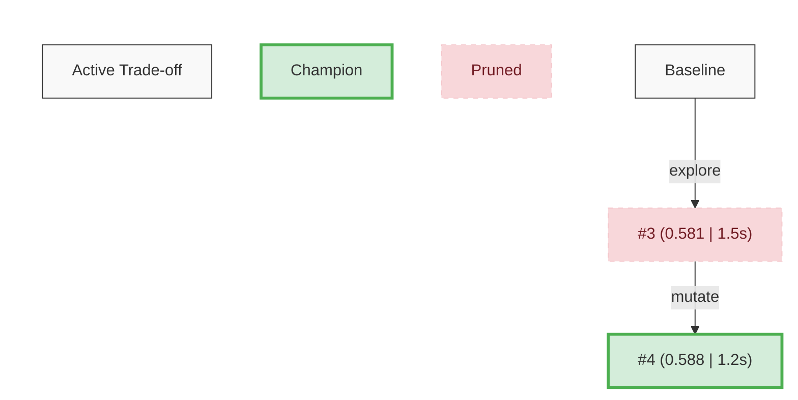

# Evolutionary Problem-Solving over GitHub PRs

This skill uses GitHub issues and PRs as an evolutionary search tree. An issue defines a problem (objective, eval command, constraints) and tracks a leaderboard. Each PR is one attempt with a score and conclusion. You iterate: study what worked, try something better, submit, repeat.

This works because each attempt's conclusion teaches the next one what to try. Scores provide objective signal. The leaderboard prevents going in circles.

No CLI tool is needed — everything is done with `gh` and `git` directly.

## Arguments

The user provides: `<issue-number> [rounds]`
- Issue number: the GitHub issue tracking the evolution problem (required)
- Rounds: how many attempts to make (default: 1)

If the user asks to set up a new problem, see "Creating a New Problem" at the bottom.

## Conventions

These conventions make everything work together. Follow them exactly.

### Labels and branches
- Label: `evolve` (on both issues and PRs)
- Branch naming: `evolve/<issue-number>/attempt-<N>-<short-description>`
- Issue title prefix: `[Evolve]`
- PR title prefix: `[Evolve]`

### Issue body structure
```
## Objective
<what to optimize>

## Evaluate
```bash
<command that prints metrics and/or a primary score>
```

## Constraints
<rules for valid attempts>

## Trait Matrix
<markdown table of attempts and their metric profiles>

## Evolutionary Search Graph


## Evolution Log
- Initialized.
```

### PR body structure
```
## Parent(s): #<pr-number> (or "-" if none)
## Strategy: explore | mutate | crossover

### Hypothesis
<what you expected>

### Method
<what you changed>

### Results
<raw output or per-component scores>

## Score: <float>

### Conclusion
<what you learned — this is the most important field>

<!-- EVOLVE_STATE: {"score": <float>, "strategy": "<strategy>", "parents": [<pr-number>, ...], "metrics": "<short string of secondary metrics>"} -->
```

### Parsing rules
- **Score & State**: Read the hidden JSON block at the bottom of the PR body `<!-- EVOLVE_STATE: {...} -->` for deterministic parsing. 
- **Eval command**: fenced code block under `## Evaluate` in issue body
- **Key insight**: first line of `### Conclusion` section (truncated to 80 chars for the Trait Matrix)

## Protocol

For each round:

### 1. Assess

Read the issue to understand the problem:

```bash
gh issue view <issue> --json title,body,state
```

From the body, extract:
- The objective (under `## Objective`)
- The eval command (code block under `## Evaluate`)
- The constraints (under `## Constraints`)
- The current profile of attempts (under `## Trait Matrix`)

### 2. Study prior attempts

List all PRs associated with this specific evolution issue to build the Phenotype Matrix. Use a high limit to prevent genetic amnesia across many rounds:

```bash
gh pr list --search "head:evolve/<issue>/ label:evolve" --state all --json number,title,state,headRefName,body --limit 1000
```

Parse the score and metrics from each PR body in the resulting JSON.

Instead of a strict 1-to-N leaderboard, view these attempts as a **Phenotype Matrix**. You are looking for **patterns in the metrics** (e.g., "The Fast/Inaccurate Profile" vs "The Slow/Precise Profile").

Identify the 2-3 most interesting or dominant profiles. Read their conclusions to decide your strategy. Use your available tools to construct whatever context you need to deeply understand the architecture of these profiles (e.g., reading diffs, entire files, or git history).

**Inspiration Context:** Even if you decide to only strictly `mutate` Parent A, you are highly encouraged to read the code/diffs of Parent B or Parent C to use as "inspiration" for your mutation. Cross-pollination of ideas is critical to escaping local maximums.

```bash
gh pr view <pr-number> --json title,body,state,headRefName
gh pr diff <pr-number>
```

The conclusions tell you what directions are promising and which are dead ends. Without studying them, you'll repeat failed experiments.

### 3. Choose a strategy

You are not limited to biological analogies. Determine the most logical meta-strategy to advance the system. Below are *examples*, but you should **invent your own evolutionary operators** (e.g., `distill`, `fuzz`, `ensemble`) if the situation demands it.

**Example Operators:**
- **`explore`**: Start with a solid, well-known approach to establish a baseline profile.
- **`mutate`**: Refine a promising trait profile. This can range from targeted parameter tuning to substantial structural refactoring.
- **`crossover`**: Explicitly combine the architecture of two complementary trait profiles.
- **`co-evolve`**: If the current solutions are trivially "gaming" the eval script (Goodhart's Law), mutate the *evaluation script itself* to add edge cases and raise the difficulty of the environment.
- **`revolution`**: If the Phenotype Matrix has stagnated at a local maximum across multiple rounds, completely discard the current architectural paradigm. Rewrite the core logic from scratch using a radically different mathematical or structural approach (e.g., shifting from procedural loops to vectorized tensor operations).

### 4. Create a branch

Determine the next attempt number by finding the highest existing attempt number and adding 1.

CRITICAL: You must checkout the correct git state for your chosen strategy. 

```bash
# If starting fresh (explore) or targeting the environment (co-evolve):
git checkout main && git pull --ff-only
git checkout -b evolve/<issue>/attempt-<N>-<short-description>

# If building on a single parent (mutate, distill, fuzz, etc.):
git fetch origin <parent-head-ref>
git checkout -b evolve/<issue>/attempt-<N>-<short-description> FETCH_HEAD

# If combining multiple parents (crossover, ensemble, etc.):
git fetch origin <parent-A-head-ref>
git checkout -b evolve/<issue>/attempt-<N>-<short-description> FETCH_HEAD
git fetch origin <parent-B-head-ref>
git merge FETCH_HEAD --no-commit # Forces a hybrid state; resolve any conflicts!
```

### 5. Implement

- Read the code you're modifying first
- One idea per attempt — don't bundle unrelated changes
- Think about why prior approaches scored the way they did
- Ensure your changes are coherent and specifically designed to improve the target metrics. Do not arbitrarily limit the scale of your changes if a major refactor is required.

### 6. Evaluate

Extract the eval command from the issue body and run it. 

**Evaluation Cascade (Fast-Fail):**
If your environment supports it, run cheap/fast heuristic tests first. If the code fails the cheap tests, do not waste compute running the full multi-hour evaluation. Immediately fail the attempt and record the error.

**Security Warning:** If this repository involves running untrusted code or dependencies, it is strongly recommended to run the eval command inside an isolated environment (e.g., Docker container) to prevent the evolutionary algorithm from executing destructive code on your host OS.

```bash
<eval-command>
```

**Self-Correction Loop:**
If the command fails, crashes, or throws a syntax error/traceback, DO NOT create the PR immediately. You have up to **3 attempts** to read the error, fix the code, and re-run the evaluation. If the code still fails after 3 attempts, proceed to create the PR but record the metrics as `failed` and note the error in the conclusion.

Note the resulting metrics from the output to populate your `EVOLVE_STATE`.

### 7. Commit and submit

```bash
git add <changed-files>
git commit -m "<descriptive message>"
git push -u origin <branch-name>
```

Create the PR with the structured body as a DRAFT to avoid cluttering reviewers and CI/CD pipelines:

```bash
gh pr create \
  --draft \
  --title "[Evolve] <short title>" \
  --label evolve \
  --body "$(cat <<'EOF'
## Parent(s): #<parent-pr> (or -)
## Strategy: <explore|mutate|crossover>

### Hypothesis
<what you expected>

### Method
<what you changed>

### Results
<per-component scores if available>

## Score: <score>

### Conclusion
<what you learned, what to try next>

<!-- EVOLVE_STATE: {"score": <score>, "strategy": "<strategy>", "parents": [<parent-pr>], "metrics": "<secondary metrics if any>"} -->
EOF
)"
```

Write a good conclusion. It should include:
- What you tried and why
- What improved and what regressed vs the parent
- Per-component scores if available
- What the next attempt should focus on

### 8. Update the issue Trait Matrix and Graph

CRITICAL: You must update the GitHub Issue immediately during this step of the round. Do not wait until all rounds are finished. 

After creating the PR, rebuild the state from all PRs using the same `gh pr list --search "head:evolve/<issue>/" ... --limit 1000` command to fetch the history. 

**1. The Trait Matrix:** Format a markdown table of all attempts. Order them logically (e.g., grouping similar trait profiles together, or roughly by overall utility).

```
| PR | Score | Metrics | Strategy | Parent(s) | Status | Key Insight |
|-----|-------|---------|----------|-----------|--------|-------------|
| #4 | 0.588 | `time:1.2s` | mutate | #3 | open | Hybrid recency+freq+IRR |
| #3 | 0.581 | `time:1.5s` | explore | - | open | LRU-LFU combo works |
```

**2. The Evolutionary Search Graph:** Use the `parents` and `strategy` fields from the JSON blocks to map the lineage (a directed acyclic graph). Generate a Mermaid.js `graph TD` block. Include the primary score and any critical secondary metrics in the node labels. Apply color-coding classes (`:::champion` for the best performing node, `:::pruned` for closed/inferior nodes). Always include a Legend subgraph. For example:


Update the main GitHub Issue body. If the issue is somehow empty or malformed, rebuild the entire `Issue body structure` (including Objective, Eval Command, Matrix, and Graph) from scratch. Otherwise, inject your new Markdown table into the `## Trait Matrix` section and your Mermaid diagram into the `## Evolutionary Search Graph` section. Use the `gh issue edit` CLI or your native tools to apply this update.

### 9. Reflect (multi-round)

Before the next round, review the Trait Matrix. Have you discovered a new pattern? Which specific metric is acting as a bottleneck for your current best profile? Are you hitting diminishing returns on a specific trait? Use this to pick the next strategy.

## Creating a New Problem

When the user wants to set up a new evolution problem, keep it fast — the goal is to get the issue on GitHub quickly so the user can see it and start evolving.

1. **Infer what you can from the codebase.** Read the existing code to understand what to optimize, what the eval script does, and what files should be constrained. The user's prompt can be minimal — fill in the gaps yourself.

2. **If an eval script doesn't exist, create one.** It should print a clear profile of metrics (e.g., Accuracy, Latency, Memory) to establish the initial Trait Matrix. Keep it simple and correct. Run it once to verify it works and note the baseline metrics.

3. **Ensure the `evolve` label exists:**
   ```bash
   gh label create evolve --description "Evolution problem" --color 7057ff 2>/dev/null || true
   ```

4. **Commit and push any new files** (eval script, baseline code, etc.) so the repo is up to date before evolution starts.

5. **Create the issue with the structured body:**
   ```bash
   gh issue create \
     --title "[Evolve] <problem title>" \
     --label evolve \
     --body "<issue body following the template above>"
   ```

6. **Print the issue URL** so the user can review it on GitHub before evolving.

Don't overthink the setup. A trivial baseline is fine — the evolution rounds will improve it.

## Pruning

When the matrix grows large, autonomously close redundant or strictly inferior PRs to keep things manageable. Prune an attempt if another attempt is **strictly better across ALL metrics** (Pareto inferior). Keep attempts that offer a unique, valuable trade-off profile. Close pruned PRs with a comment explaining why, delete their remote branches, and update the issue's Trait Matrix to show only the kept entries. Do not interrupt the evolution loop to ask for permission.

## Finalizing (Champion Merge)

When the user requests to wrap up or "Finalize" an evolution problem (e.g., `Finalize evolve issue <N>`), your goal is to merge the winning strategy and clean up the environment:

1. **Identify the Winner:** Read the issue leaderboard and identify the most valuable PR based on the trait matrix.
2. **Promote:** Remove the draft status from the winning PR and request a human review (or merge it directly if the user explicitly authorized it).
3. **Clean Up Runners-up:** Close all other open PRs for this issue.
4. **Delete Branches:** Delete the remote branches for the runner-up PRs.
5. **Close Issue:** Close the main GitHub Issue with a summary comment highlighting the final baseline vs. final metric profile and the key insights learned.

## Updating the Skill

If the user explicitly asks to "update the evolve skill" or "check for updates to the evolve skill":
1. Fetch the latest `SKILL.md` from the `main` branch of the `source` repository listed in the frontmatter:
   `curl -s https://raw.githubusercontent.com/kaiwong-sapiens/gh-evolve/main/skills/evolve/SKILL.md`
2. Compare the fetched content to your currently loaded instructions.
3. If there are meaningful updates, overwrite your local skill definition file with the new content and inform the user of the new capabilities.
